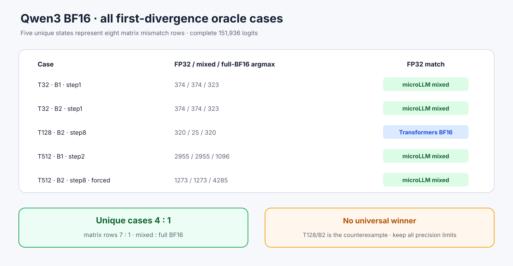

# Experiment 366 — 一个case支持microLLM，能代表其余7行吗

Status: `all eight mismatches attributed; no universal BF16 winner`

8个mismatch去重成5个首次分叉状态。统一runner对每格导出两种FP32、当前microLLM mixed BF16、
Transformers BF16完整151,936 logits；可执行时还跑weight/cache四格。每格进入capture前必须共享
输入，两种FP32 argmax必须相同。

T32/B1、T32/B2、T512/B1与强制同输入的T512/B2由microLLM mixed匹配FP32；T128/B2反例由
Transformers BF16匹配FP32，microLLM把320/25顺序翻转。5个case为4:1；映射回原N4/N32矩阵
是7:1。全局Max/RMS更小也不能保证低margin top-2顺序正确。

T512/B2的自然FP32在step2已与两种低精度分开，不能直接比较step8。新增审计专用
`--forced-decode-inputs`，给C++和PyTorch完全相同的9个输入；CLI只允许zero-warmup、single-step、
steady cached decode，并验证每个token在词表内。

全部原始mismatch仍保留`precision_mismatch`：oracle说明某个离散argmax更接近FP32，不证明两种
BF16数值相同，也不授权把mixed BF16设成通用默认。下一步从唯一microLLM失败T128/B2定位
weight还是Cache导致top-2翻转。
