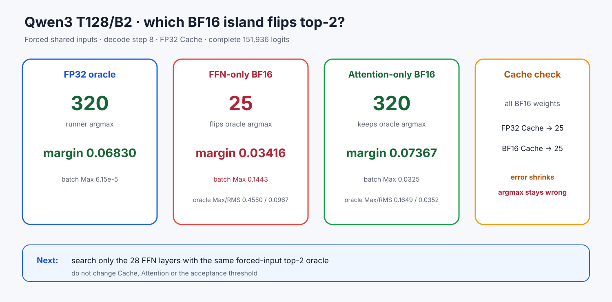

# Experiment 367 — T128错在Cache、Attention还是FFN

Status: `FFN weight island isolated; layer search admitted`

固定T128/B2 step8共同9-token输入与FP32 Cache。FFN-only BF16已经把FP32的320翻成25，
top-2错误margin 0.03416；Attention-only仍选320且margin 0.07367。FFN-only/Attention-only
oracle Max/RMS为0.4550/0.0967与0.1649/0.0352，batch内Max为0.1443与0.0325。

全部BF16 weights+FP32 Cache也选25；改BF16 Cache后全局Max/RMS从0.3457/0.0705降低到
0.1165/0.0249、错误margin缩到0.00674，但argmax仍未恢复。因此Cache是调节因素，不是这次
top-2翻转的必要原因；Attention岛也不是。

结论只把下一搜索空间收窄到28层FFN。下一节点使用`bf16_ffn_fp32_layers`做预先固定的分半/层级
搜索；不改Attention、Cache或阈值，也不以全局误差替代top-2 oracle。
