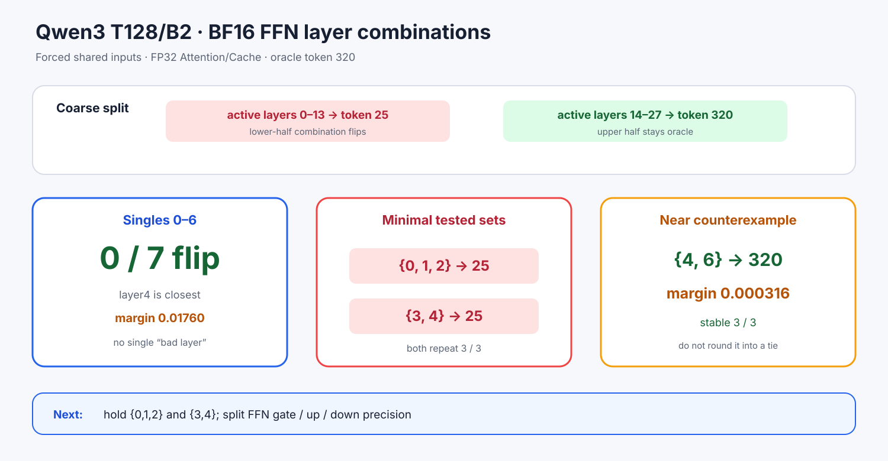

# Experiment 368 — FFN失败来自一层，还是多层一起累积

Status: `two minimal tested combinations found; substage split next`

固定T128/B2、共同输入、FP32 Attention/Cache与完整logit oracle，只改变哪些FFN层为BF16。
后半14–27安全，前半0–13翻转；继续分组得到0–2和3–6两组都能独立翻转。

0–6每个单层都选oracle 320。0–2的三个pair也都安全，三层一起才选25；3–6的9个内部pair
只有`{3,4}`选25。因此最小已验证组合为`{0,1,2}`和`{3,4}`，分别3/3进程稳定。
近边界`{4,6}` margin只有0.0003157，但3/3仍选320。

“最小”限定于本实验检查的组内proper subsets，不声称穷举28层所有组合。结论反驳“找一个坏层
改回FP32就结束”：误差是跨层组合效应。下一节点拆gate/up/down子阶段，保持层集合、输入和
top-2门不变。
