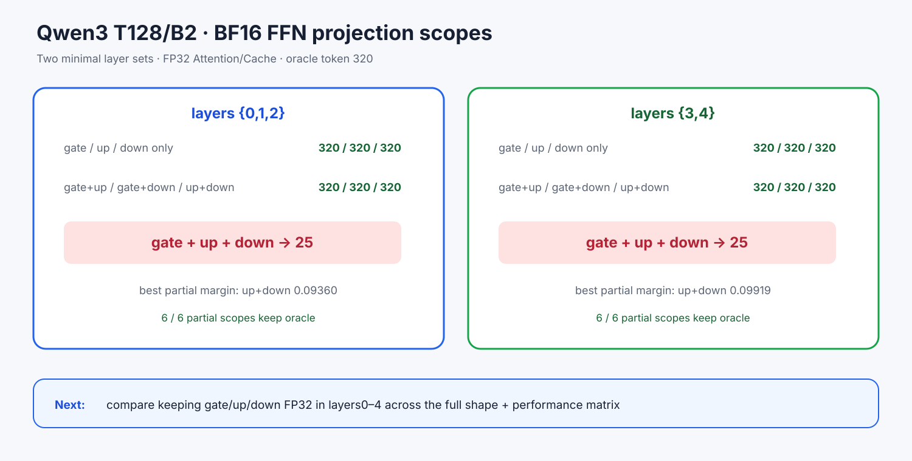

# Experiment 369 — gate、up、down哪一个单独导致翻转

Status: `all-three interaction isolated; selective policy gate next`

新增七种`Bf16FfnWeightScope`。三投影全BF16继续走融合FFN；任意partial scope走三个Linear的
显式fallback。CPU测试覆盖七种dtype布局、forward和非法scope；CLI覆盖scope合同。

固定层集合`{0,1,2}`和`{3,4}`。两个集合中，gate/up/down单独BF16与三种两投影组合全部选择
oracle 320；只有gate+up+down三者同时BF16才选25。12/12 partial scope通过。

若只看本case margin，保留gate FP32、让up+down BF16在两个集合都最大（0.09360/0.09919）。
但partial scope失去all-BF16融合路径，且其他shape可能改变答案。下一节点必须比较三种“保留一个
投影FP32”的完整shape矩阵、常驻与速度，不能从一个margin直接改默认。
