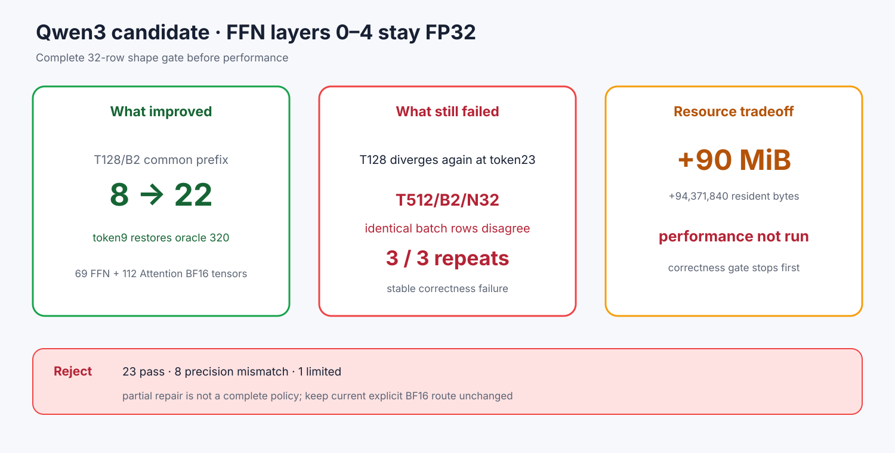

# Experiment 370 — 修好第9个token，为什么候选仍然必须拒绝

Status: `candidate rejected before performance`

候选让layers0–4完整FFN保持FP32，其余23层FFN与全部Attention为BF16。常驻按公式增加
94,371,840字节，69个FFN和112个Attention tensor仍为BF16。

完整32-row矩阵中，T128/B2/N32第9个token恢复320，共同前缀从8延长到22；但第23个token再次
分叉。T512/B2/N32让两个相同batch row生成不同token，worker按合同失败；独立3次重跑3/3复现
同一错误。候选从当前24 pass/8 mismatch变成23 pass/8 mismatch/1 limited。

因此候选在性能前拒绝，计划中的重复速度runner被删除。这个结果反驳“打断已知最小组合就能得到
完整策略”：后续误差和batch调度仍会改变低margin决策。下一候选必须由完整矩阵约束，不能只修
T128第一个分叉。
