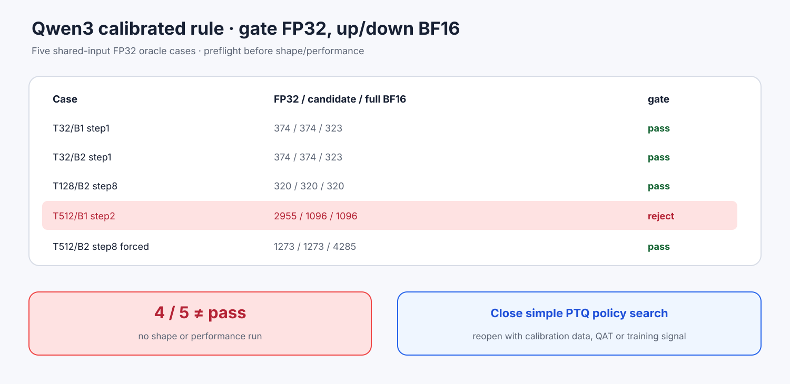

# Experiment 371 — 全模型gate保留FP32，能成为简单校准规则吗

Status: `4/5 oracle cases; calibration rule rejected`

候选不是再拼层：所有FFN gate FP32，up/down与Attention BF16，BF16 Cache。五个首次分叉状态
使用共同FP32 oracle预筛。

T32/B1、T32/B2、T128/B2和强制T512/B2匹配FP32；T512/B1失败。该格FP32选2955，候选与
Transformers BF16都选1096，候选错误margin 0.003286。4/5不满足全部case门。

候选在32-row和性能前拒绝。结合Experiment 370，当前“手工早期层”与“全局保留一个投影”两类
简单后训练BF16校准都已有反例。重新开启需要校准集搜索、QAT或训练信号，而不是再排列固定
FP32层/投影。
