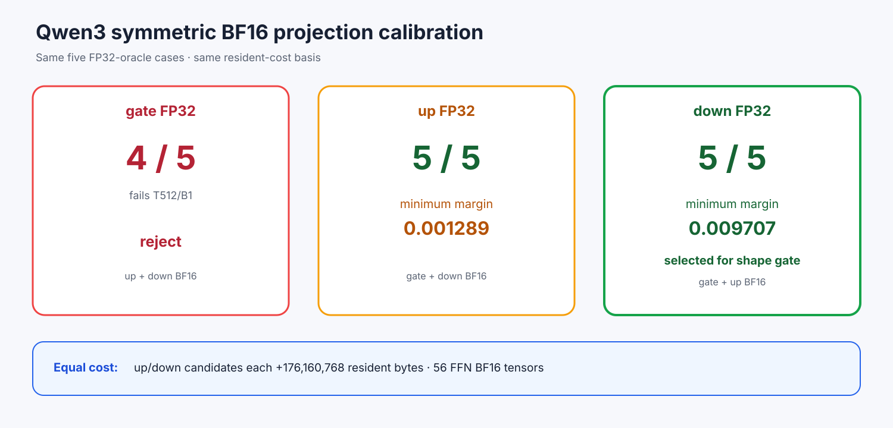

# Experiment 372 — 三条对称规则都测，怎样选择下一个候选

Status: `down-FP32 selected for full shape gate; not admitted`

同一五case FP32 oracle比较全模型gate/up/down分别保留FP32。gate-FP32只过4/5；up-FP32与
down-FP32均5/5。两者各保留56个FFN、112个Attention BF16 tensor，常驻都是
1,679,556,608字节，比当前增加176,160,768字节。

内存相同后，按预先可解释的最小top-2 margin选择：up-FP32最小0.001289，down-FP32最小
0.009707。因此down-FP32（gate+up BF16）进入完整32-row gate。

这不是keep/default。partial projection失去融合FFN，完整shape可能出现batch失败，性能也可能
严重回退。只有后续正确性与重复性能都过线才可晋级。
