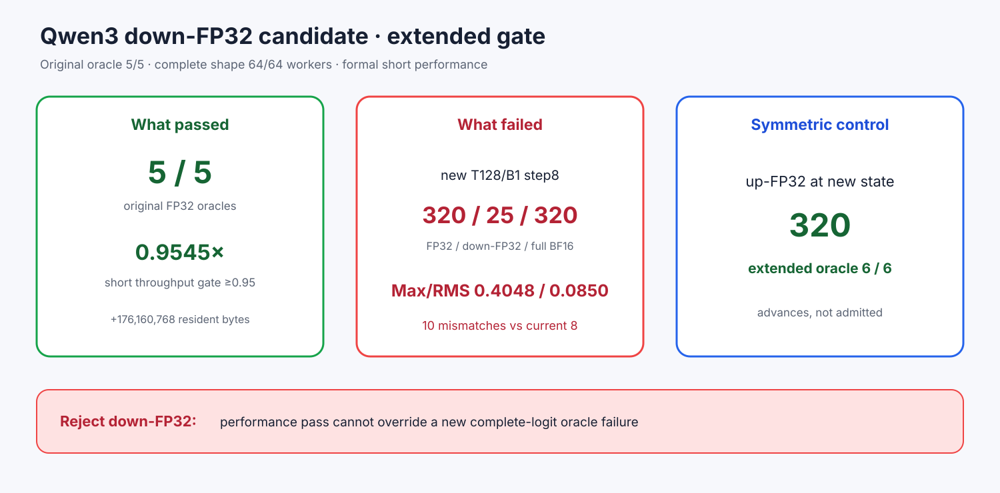

# Experiment 373 — 5/5预筛通过，为什么完整轨迹还能推翻候选

Status: `down-FP32 rejected; up-FP32 advances`

down-FP32候选原五case 5/5。正式T1/B1/N4三进程2+5为221.98 vs232.56 tok/s=`0.9545×`，
刚过0.95；常驻准确增加176,160,768字节。

warmup2完整矩阵64/64 worker执行，却产生10个mismatch（当前8个）。新T128/B1 step8 oracle中，
FP32/Transformers选320，down-FP32选25，Max/RMS 0.4048/0.0850。候选因此拒绝，性能通过不能
覆盖答案失败。

对称up-FP32在同一新增状态选320，累计6/6 oracle，只晋级完整shape门。本实验说明
first-divergence preflight不是完整轨迹证明；新policy必须让矩阵产生的新分叉再次接受oracle。
