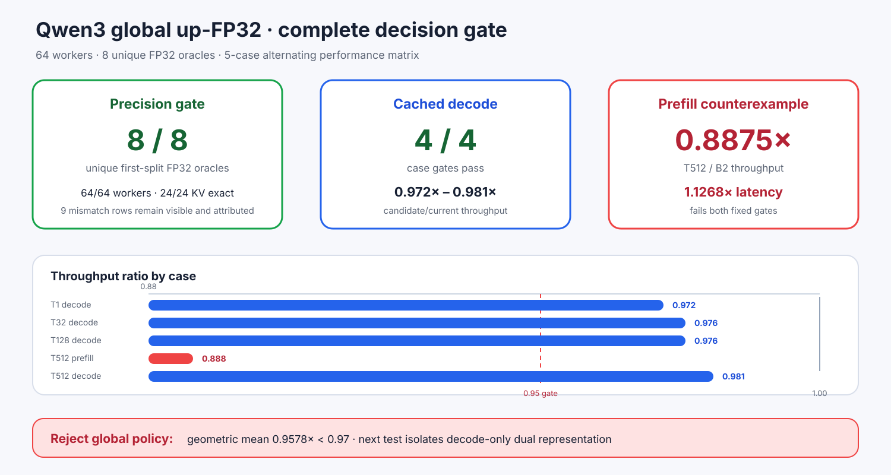

# Experiment 374 — 精度8/8，为什么仍不能成为默认策略

Status: `global up-FP32 rejected on performance`

候选把FFN up留在FP32，gate/down和全部Attention转为BF16。它完成64/64 worker与32行shape；
24个cached行的KV actual/theoretical完全相等。跨框架有9行token不同，但每一行都保留为
`precision_mismatch`，再用共同FP32 oracle判断首次分叉，而不是要求microLLM复制另一个低精度
实现。新T128/B2 step22为`4226/4226/3270`，新T512/B2 step2为`2955/2955/1096`，顺序均为
FP32/up-FP32/Transformers BF16。扩展唯一状态达到8/8。

性能门固定五个场景，每个策略3个新进程、交替顺序、2次热身、5次测量。四个decode场景均过
0.95吞吐与1.05延迟门；T512/B2 prefill却只有0.8875x吞吐、1.1268x延迟。几何均值0.9578x，
低于0.97。增量峰值全部通过，常驻代价固定为+176,160,768字节，因此失败不能归因于一次OOM。

结论：答案更好不能覆盖稳定的prefill回退；全局策略拒绝。下一反驳实验不是放宽阈值，而是
只改变计算阶段：保留全BF16 fused prefill，decode才读FP32 up。该方案需要双表示，尚无性能或
内存结论。
