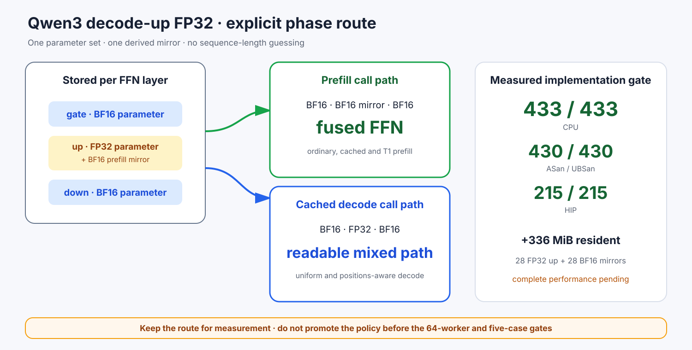

# Experiment 375 — 不按shape猜阶段：为反驳实验建立双表示路径

Status: `route implemented; complete gate pending`

Experiment 374说明全局up-FP32的四个decode都过门，失败集中在prefill。新的最小假设不是降低
阈值，而是让同一FFN按真实阶段选择表示：prefill读BF16 up mirror并继续三投影融合；cached
decode读FP32 up参数，gate/down仍是BF16。

阶段由Block调用点显式传入。`T==1`不能作为判断，因为单token prefill也是合法输入。mirror随
模型移动但不进入参数表或checkpoint。CLI显式且默认关闭，shape runner也会回显policy。

Qwen3 smoke为56个BF16主参数、28个FP32 decode up和28个BF16 prefill mirror；常驻
1,855,717,376字节，比全BF16多336MiB。CPU 433/433、sanitizer 430/430、HIP 215/215通过。

本节点只keep机制，不keep性能策略。下一步仍要跑八个oracle、完整shape和五场景门；在那之前
不得把“prefill会恢复”写成实测结论。
