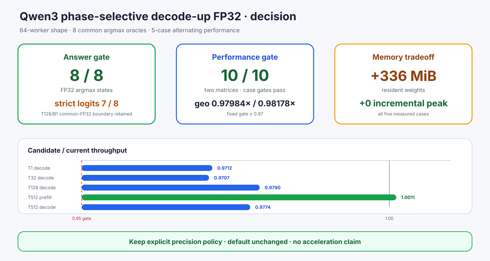

# Experiment 376 — 恢复prefill以后，精度、速度和内存怎样一起判

Status: `keep explicit policy; default unchanged`

phase route完成64/64 worker和24/24精确KV。跨框架仍有9行差异，但八个固定首分叉argmax全部
匹配FP32。严格完整向量common-oracle是7/8：T128/B1的两个FP32实现略超固定Max/RMS门，
虽然都选320。报告必须同时写8/8 argmax与7/8 strict，不能合并成一句“完全对齐”。

性能矩阵每case 3个新进程、2次热身、5次测量。五个比值是0.9712、0.9707、0.9790、1.0011、
0.9774，几何均值0.97984，全部过门。关键反例T512/B2 prefill从0.8875恢复到1.0011；所有
增量峰值相同。代价是常驻+336MiB。

首轮T128出现一次candidate慢样本，因此在另一张VF完整重复30进程。复测五case仍全部通过，
几何均值0.98178，T128三次稳定。最终证据是60个性能进程与10/10 case-gates，不删除首轮波动。

结论：keep默认关闭的精度策略，不把它称为加速，也不替换默认all-BF16。简单全局投影搜索至此
关闭；新工作应扩大prompt/硬件/训练尺度，而不是继续用一个margin挑规则。
