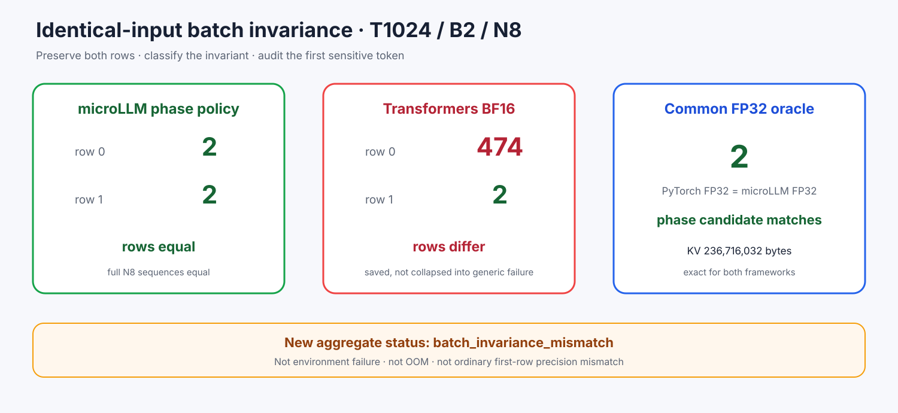

# Experiment 377 — `failed`不是足够的batch证据

Status: `row-level batch evidence contract kept`

T1024/B2相同输入让Transformers BF16两行产生不同token。旧worker直接报`failed`，隐藏了哪一行
错、另一行是否正确。新合同保存全部行、跨测量确定性，并用`batch_invariance_mismatch`单独分类。

真实N8结果：microLLM两行都选2；Transformers row0选474、row1选2。B1完整logit oracle中
PyTorch FP32、microLLM FP32和phase候选均选2。两边KV都精确为236,716,032字节。

本节点keep测试基础设施，不作单样本速度结论。长上下文矩阵必须从头重跑。
