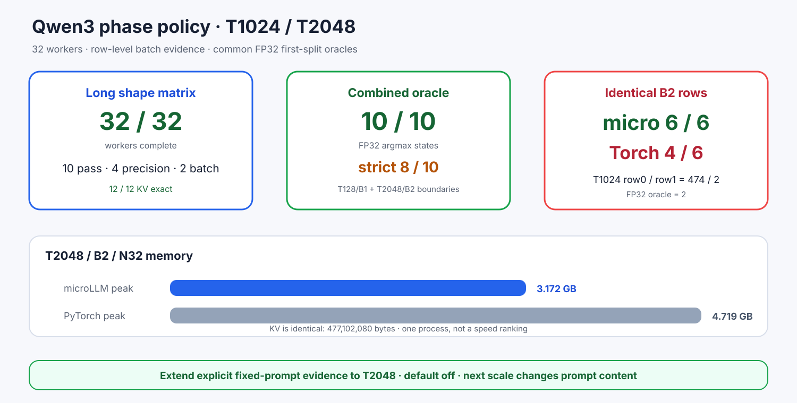

# Experiment 378 — 短上下文通过后，长上下文暴露了什么

Status: `explicit fixed-prompt boundary extended through T2048`

T1024/T2048矩阵32/32 worker完成：10 pass、4 precision mismatch、2 batch-invariance mismatch。
全部12个KV行精确。microLLM所有B2行一致；Transformers BF16在T1024/B2把相同输入分成474/2。

共同FP32 oracle支持phase候选：T1024选2而非474，T2048/B2选16而非220。T2048的micro/PyTorch
FP32 Max为2.193e-4，略超固定2e-4，RMS仍过门。合并短长状态是10/10 argmax、8/10 strict。

最大KV477MB，T2048/B2/N32峰值microLLM/PyTorch为3.172/4.719GB。由于每shape只有一个进程，
不作吞吐排名。keep显式固定prompt证据到T2048；下一反驳尺度必须改变prompt内容。
