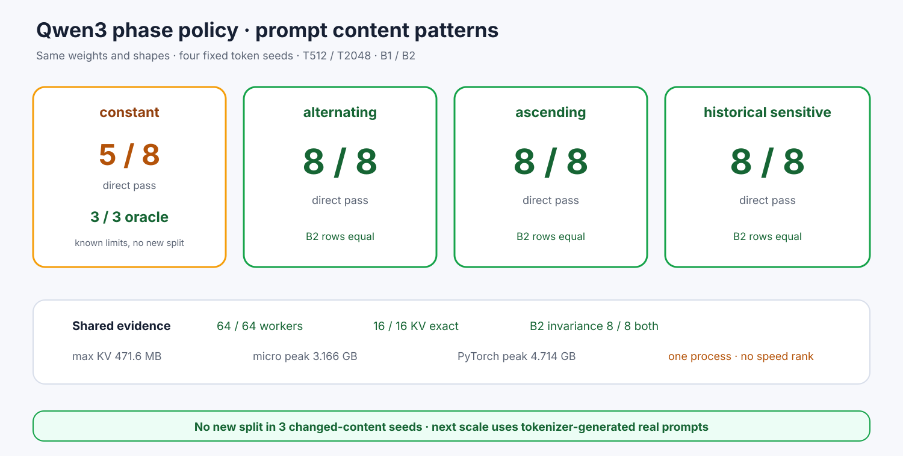

# Experiment 379 — 改变prompt内容，分叉会跟着走吗

Status: `three changed-content patterns pass; constant limits retained`

固定模型、权重、phase策略和shape，只把prompt seed改成constant、alternating、ascending、
sensitive。64/64 worker、32行完成：29 pass、3 precision mismatch。

三行分叉全部属于constant，并已由FP32 oracle支持候选；另外三种pattern合计24/24直接一致。
两个框架B2行均8/8一致，KV16/16精确。最大峰值microLLM/PyTorch为3.166/4.714GB。

结论：keep三种合成内容变化，没有新分叉；constant边界不删除。下一实验必须使用tokenizer产生的
自然语言/结构化prompt。单进程shape不作吞吐排名。
