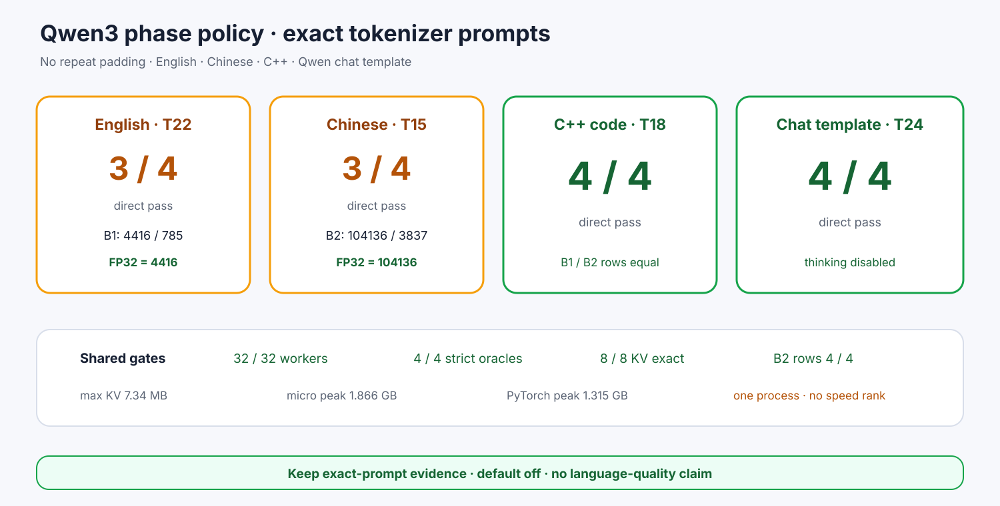

# Experiment 380 — 不重复token，真实prompt还会稳定吗

Status: `four exact prompts pass with two attributed splits`

固定Qwen3 tokenizer生成英文、中文、C++代码和chat-template四条prompt，长度22/15/18/24；不重复
填充。32/32 worker完成：14 pass、2 precision mismatch、0 batch失败。

英文B1的785/4416和中文B2的3837/104136都由B1/B2完整logit oracle判给phase候选；四份strict
common-FP32 gate全过。代码和chat 8/8直接一致，KV8/8精确。

这两个分叉来自Transformers BF16跨batch算法变化，但每个B2内部行仍一致。keep四prompt显式证据，
不作语言质量或单样本速度结论。
