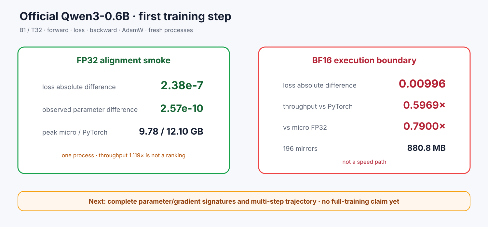

# Experiment 381 — Qwen3能训练一步，不等于训练已经对齐

Status: `FP32 alignment smoke passes; BF16 execution only`

官方Qwen3 B1/T32一步完成forward/loss/backward/AdamW。FP32 loss差2.38e-7，观测参数差2.57e-10，
峰值micro/PyTorch 9.78/12.10GB。

BF16路径也执行，但loss差0.00996，196份mirror占880.8MB；吞吐仅PyTorch 0.5969x、micro FP32
0.7900x，峰值是自身FP32的1.0901x。因此BF16只算execution smoke，不是加速。

下一道证据门是全部参数/梯度签名与多步轨迹；一个观测参数不能代表完整模型。
