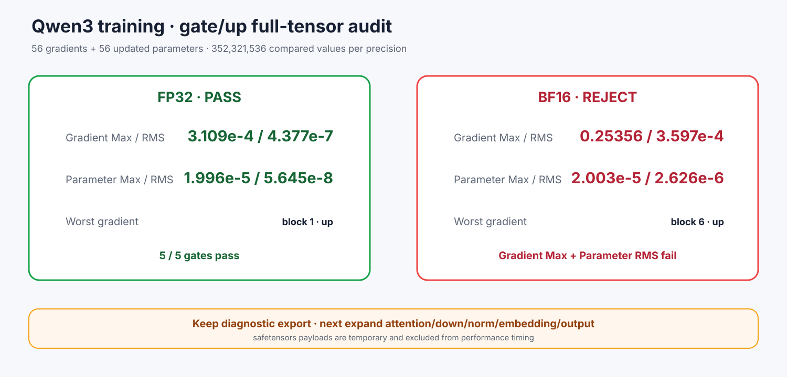

# Experiment 382 — 一个参数对齐以后，再比较3.52亿个值

Status: `FP32 pass; BF16 rejected`

训练worker新增诊断导出：AdamW前56个gate/up梯度，更新后56个参数，分别176,160,768元素。
PyTorch转成microLLM内部名字和`[K,N]`后逐元素比较。

FP32 Gradient Max/RMS 3.109e-4/4.377e-7，Parameter 1.996e-5/5.645e-8，全部过门。
BF16 Gradient 0.25356/3.597e-4，Parameter 2.003e-5/2.626e-6；Gradient Max和Parameter RMS
失败，最坏是block6 up。

结论：官方FP32 gate/up对齐；当前BF16训练公式拒绝。导出不参与计时，remaining families仍要测。
