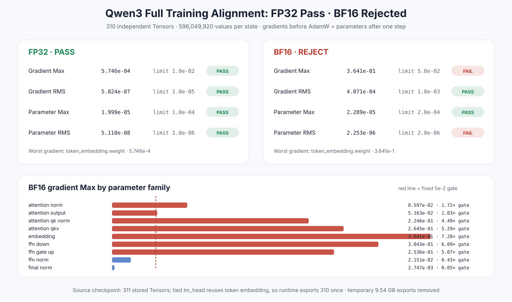

# Experiment 383 — 从两个 FFN 投影扩到全部独立训练参数

Status: `FP32 pass; BF16 rejected`

官方 Qwen3 checkpoint 有311个存储Tensor；tied lm_head只形成310个独立运行时Tensor。
本节点在AdamW前比较596,049,920个梯度值，在一步后比较同量参数值。

FP32 Gradient Max/aggregate RMS为5.746e-4/5.024e-7，Parameter为
1.999e-5/5.110e-8，固定聚合门全部通过。BF16为0.3641/4.071e-4和
2.289e-5/2.253e-6，Gradient Max与Parameter RMS失败。

族别归因把BF16最坏值放在tied embedding；Attention QKV、FFN down、gate/up也分别达到
0.2645、0.3043、0.2536。所有名字、shape、计数与有限值检查通过。

RMS门是全模型aggregate，不是per-Tensor门；FP32最坏单Tensor梯度RMS 2.356e-5被单独
保留。结论是保留FP32一步全参数对齐，拒绝当前BF16公式。moment与多步轨迹仍是下一层。
