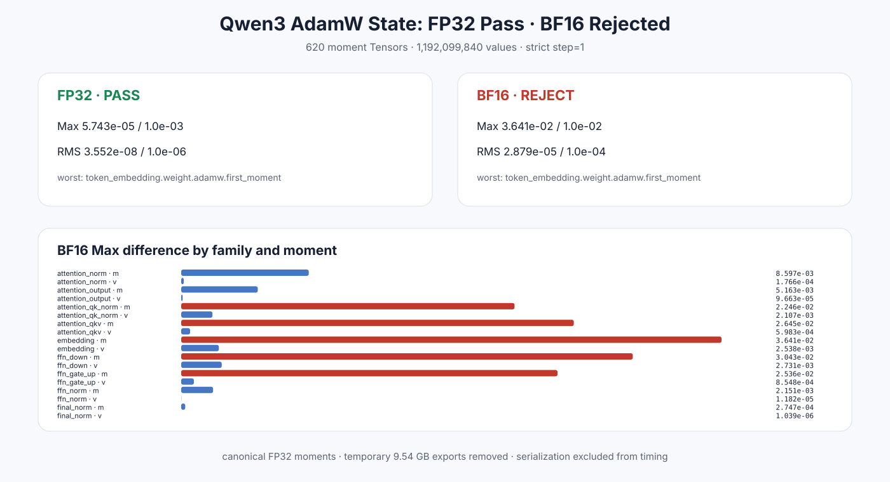

# Experiment 384 — 参数对齐以后，检查 AdamW 的全部记忆

Status: `FP32 pass; BF16 rejected`

310个参数×first/second moment形成620个Tensor、1,192,099,840个值。FP32 Max/RMS `5.743e-5/3.552e-8`通过；BF16 forward+FP32 moments为`0.03641/2.879e-5`，Max门失败。step双方严格为1，全部名字、shape、有限值通过。

结论：保留FP32完整一步optimizer state对齐；当前BF16梯度差已经进入AdamW状态。BF16 moment存储与多步轨迹仍分开。
