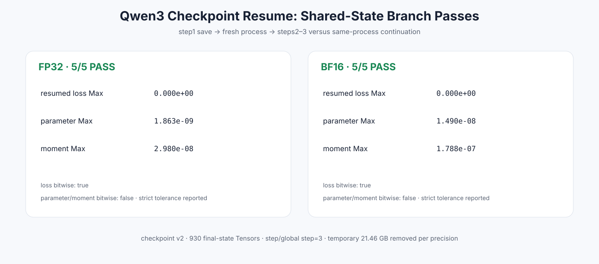

# Experiment 386 — 同一个 step1 状态分叉后恢复

Status: `FP32/BF16 resume pass`

第一次“各自重算step1”的bitwise门被反例推翻。最终共享checkpoint分叉中，两种精度loss bitwise，参数/moment在严格恢复容差内，step=3。checkpoint保存恢复成立，但原子tied路径不冒充bitwise。
