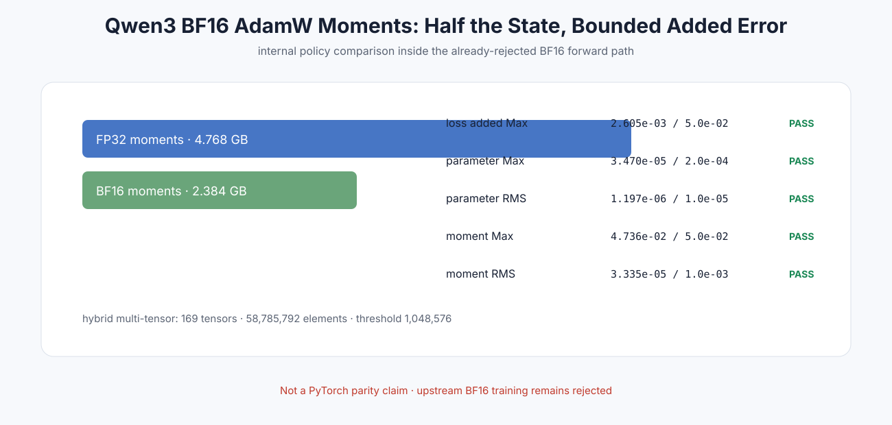

# Experiment 387 — BF16 optimizer 记忆减半

Status: `internal policy pass; upstream BF16 still rejected`

FP32→BF16 moments节省2.384GB。三步loss/参数/moment五项误差与精确半内存门共6/6通过；169个小Tensor走hybrid multi-tensor。结论只适用于内部压缩策略，不改变BF16跨框架拒绝。
